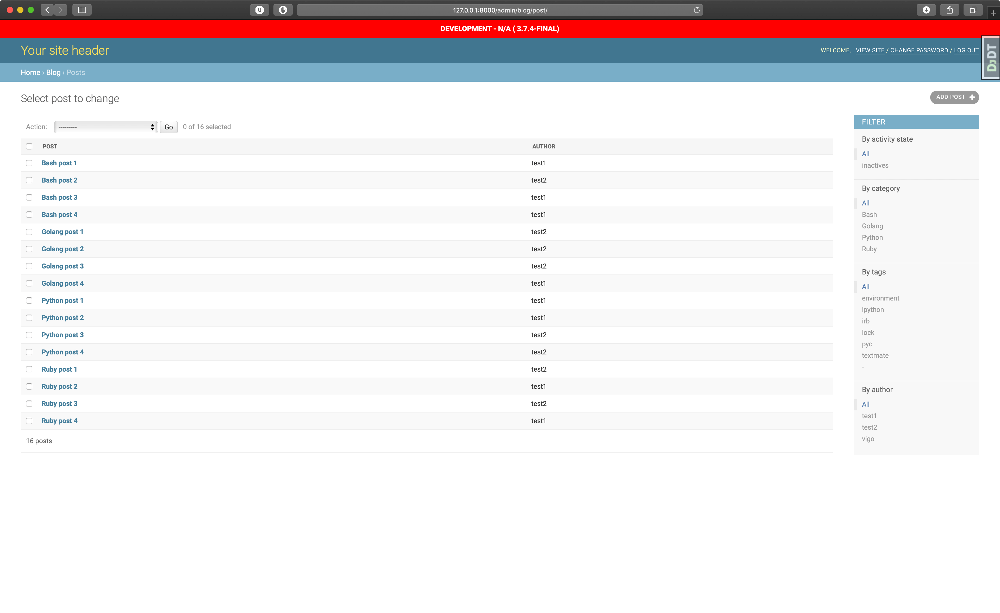
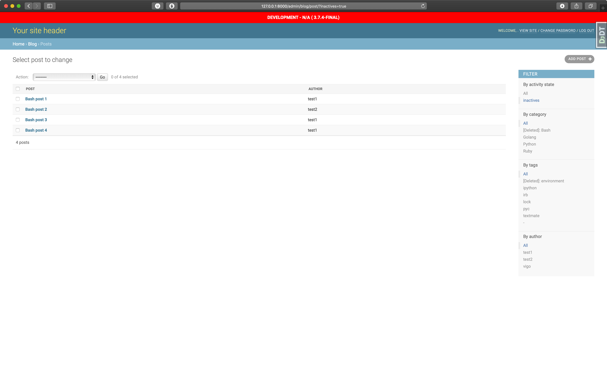
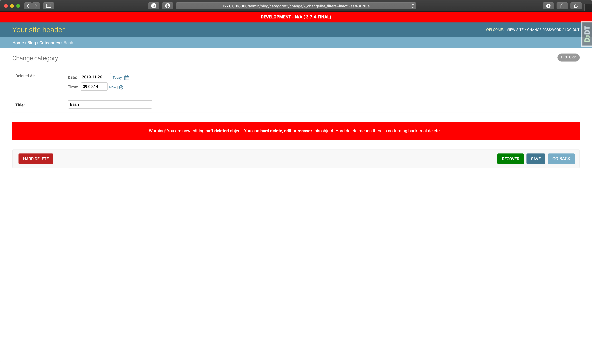
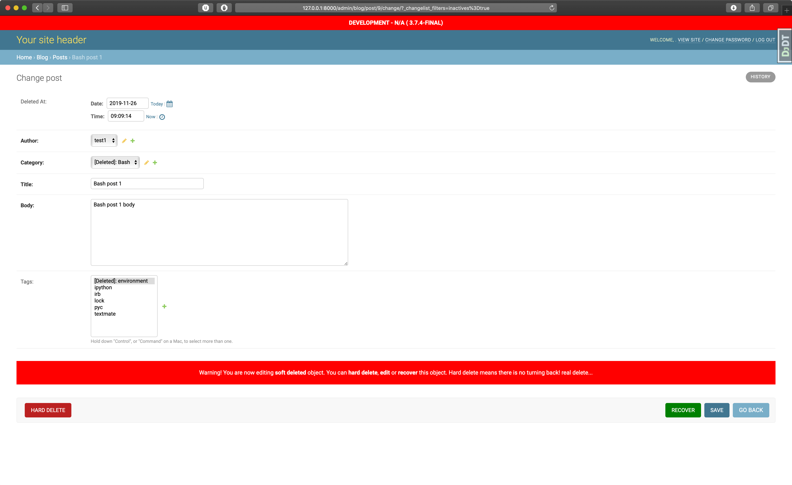

[](https://www.codacy.com/manual/vigo/django-vb-baseapp?utm_source=github.com&amp;utm_medium=referral&amp;utm_content=vbyazilim/django-vb-baseapp&amp;utm_campaign=Badge_Grade)

# django-vb-baseapp

This is a helper app for https://github.com/vbyazilim/django-vb-admin
Before you use this, you need to install `django-vb-admin`:

```bash
$ pip install django-vb-admin
$ django-vb-admin -h
```

Also, package is available on pip but dependent to `django-vb-admin`:

```bash
$ pip install django-vb-baseapp
```

## Features

- Two abstract custom base models: `CustomBaseModel` and `CustomBaseModelWithSoftDelete`
- Two custom base model admins for `CustomBaseModelAdmin` and `CustomBaseModelAdminWithSoftDelete`
- Soft deletion feature and admin actions for `CustomBaseModelAdminWithSoftDelete`
- `pre_undelete` and `post_undelete` signals for **soft delete** operation
- Pre enabled models admin site: `ContentTypeAdmin`, `LogEntryAdmin`, `PermissionAdmin`, `UserAdmin`
- Timezone and locale middlewares
- HTML level onscreen debugging feature for views!
- Handy utils: `numerify`, `save_file`, `SlackExceptionHandler`
- Fancy file widget: `AdminImageFileWidget` for `ImageField` on admin by default
- `OverwriteStorage` for overwriting file uploads
- Custom file storage for missing files for development environment: `FileNotFoundFileSystemStorage`
- Custom and configurable error page views for: `400`, `403`, `404`, `500`
- Custom management command with basic output feature `CustomBaseCommand`
- Builtin `console`, `console.dir()` via `vb-console` [package][vb-console]
- Simpler server logging for `runserver_plus`
- This project uses [bulma.io][bulma.io] as HTML/CSS framework, ships with **jQuery** and **Fontawesome**

---

## Screenshots

<table>
    <tr>
        <td></td>
        <td></td>
    </tr>
    <tr>
        <td></td>
        <td></td>
    </tr>
</table>

---

## Tutorial

Let’s build a basic blog with categories! First, create your virtual environment:

```bash
# via builtin
$ python -m venv my_env
$ source my_env/bin/activate

# or via virtualenvwrapper
$ mkvirtualenv my_env
```

Now, create you database;

```bash
$ createdb my_project_dev
```

Now set your environment variables:

```bash
$ export DJANGO_SECRET=$(head -c 75 /dev/random | base64 | tr -dc 'a-zA-Z0-9' | head -c 50)
$ export DATABASE_URL="postgres://localhost:5432/my_project_dev"
```

Edit `my_env/bin/activate` or `~/.virtualenvs/my_env/bin/postactivate`
(*according to your virtualenv creation procedure*) and put these export
variables in it. Will be handy next time you activate the environment. Now;

```bash
$ pip install django-vb-admin
$ cd /path/to/my-django-project
$ django-vb-admin startproject
# or
$ django-vb-admin startproject --target="/path/to/folder"
```

You’ll see:

```bash
Setup completed...
Now, create your virtual environment and run

	pip install -r requirements/development.pip

```

message. Now;

```bash
$ pip install -r requirements/development.pip
$ python manage.py migrate
Operations to perform:
  Apply all migrations: admin, auth, contenttypes, sessions
Running migrations:
  Applying contenttypes.0001_initial... OK
  Applying auth.0001_initial... OK
  Applying admin.0001_initial... OK
  Applying admin.0002_logentry_remove_auto_add... OK
  Applying admin.0003_logentry_add_action_flag_choices... OK
  Applying contenttypes.0002_remove_content_type_name... OK
  Applying auth.0002_alter_permission_name_max_length... OK
  Applying auth.0003_alter_user_email_max_length... OK
  Applying auth.0004_alter_user_username_opts... OK
  Applying auth.0005_alter_user_last_login_null... OK
  Applying auth.0006_require_contenttypes_0002... OK
  Applying auth.0007_alter_validators_add_error_messages... OK
  Applying auth.0008_alter_user_username_max_length... OK
  Applying auth.0009_alter_user_last_name_max_length... OK
  Applying auth.0010_alter_group_name_max_length... OK
  Applying auth.0011_update_proxy_permissions... OK
  Applying sessions.0001_initial... OK
```

Now, we have a ready Django project. Let’s check;

```bash
$ python manage.py runserver_plus
INFO |  * Running on http://127.0.0.1:8000/ (Press CTRL+C to quit)
INFO |  * Restarting with stat
Performing system checks...

System check identified no issues (0 silenced).

Django version 2.2.6, using settings 'config.settings.development'
Development server is running at http://[127.0.0.1]:8000/
Using the Werkzeug debugger (http://werkzeug.pocoo.org/)
Quit the server with CONTROL-C.
WARNING |  * Debugger is active!
WARNING |  * Debugger PIN disabled. DEBUGGER UNSECURED!
```

Let’s create a new app!

```bash
$ python manage.py create_app blog
"blog" application created.


    - Do not forget to add your `blog` to `INSTALLED_APPS` under `config/settings/base.py`:

    INSTALLED_APPS += [
        'django_extensions',
        'blog.apps.BlogConfig', # <-- add this
    ]

    - Do not forget to fix your `config/urls.py`:

    # ...
    # add your newly created app's urls here!
    urlpatterns += [
        # ...
        # this is just an example!
        path('__blog__/', include('blog.urls', namespace='blog')),
        # ..
    ]
    # ...
```

You can follow the instructions, fix your `config/settings/base.py` and
`config/urls.py` as seen on the command output. Now run development server
and call the url:

```bash
$ python manage.py runserver_plus
```

Open `http://127.0.0.1:8000/__blog__/`. Also, another builtin app is running;
`http://127.0.0.1:8000/__vb_baseapp__/`. You can remove `__vb_baseapp__`
config from `config/urls.py`.

Now let’s add some models. We have 3 choices as parameter:

1. `django`: Uses Django’s `models.Model`
1. `basemodel`: Uses `CustomBaseModel`
1. `softdelete`: Uses `CustomBaseModelWithSoftDelete`

We’ll use soft deletable model feature. Let’s create `Post` and `Category`
models:

```bash
$ python manage.py create_model blog post softdelete

models/post.py created.
admin/post.py created.
post model added to models/__init__.py
post model added to admin/__init__.py


    `post` related files created successfully:

    - `blog/models/post.py`
    - `blog/admin/post.py`

    Please check your models before running `makemigrations` ok?

$ python manage.py create_model blog category softdelete
models/category.py created.
admin/category.py created.
category model added to models/__init__.py
category model added to admin/__init__.py


    `category` related files created successfully:

    - `blog/models/category.py`
    - `blog/admin/category.py`

    Please check your models before running `makemigrations` ok?

$ python manage.py create_model blog tag softdelete
models/tag.py created.
admin/tag.py created.
tag model added to models/__init__.py
tag model added to admin/__init__.py


    `tag` related files created successfully:

    - `blog/models/tag.py`
    - `blog/admin/tag.py`

    Please check your models before running `makemigrations` ok?

```

Let’s fix models before creating and executing migrations:

```python
# blog/models/post.py

import logging

from django.conf import settings
from django.db import models
from django.utils.translation import ugettext_lazy as _

from console import console
from vb_baseapp.models import CustomBaseModelWithSoftDelete

__all__ = ['Post']

logger = logging.getLogger('app')
console = console(source=__name__)


class Post(CustomBaseModelWithSoftDelete):
    author = models.ForeignKey(
        to=settings.AUTH_USER_MODEL, on_delete=models.CASCADE, related_name='posts', verbose_name=_('author')
    )
    category = models.ForeignKey(
        to='Category', on_delete=models.CASCADE, related_name='posts', verbose_name=_('category')
    )
    title = models.CharField(max_length=255, verbose_name=_('title'))
    body = models.TextField(verbose_name=_('body'))
    tags = models.ManyToManyField(to='Tag', related_name='posts', blank=True)

    class Meta:
        app_label = 'blog'
        verbose_name = _('post')
        verbose_name_plural = _('posts')  # check pluralization

    def __str__(self):
        return self.title
```

and `Category`:

```python
# blog/models/category.py

import logging

from django.db import models
from django.utils.translation import ugettext_lazy as _

from console import console
from vb_baseapp.models import CustomBaseModelWithSoftDelete

__all__ = ['Category']

logger = logging.getLogger('app')
console = console(source=__name__)


class Category(CustomBaseModelWithSoftDelete):
    title = models.CharField(max_length=255, verbose_name=_('title'))

    class Meta:
        app_label = 'blog'
        verbose_name = _('category')
        verbose_name_plural = _('categories')  # check pluralization

    def __str__(self):
        return self.title
```

and `Tag`:

```python
# blog/models/tag.py

import logging

from django.db import models
from django.utils.translation import ugettext_lazy as _

from console import console
from vb_baseapp.models import CustomBaseModelWithSoftDelete

__all__ = ['Tag']

logger = logging.getLogger('app')
console = console(source=__name__)


class Tag(CustomBaseModelWithSoftDelete):
    name = models.CharField(max_length=255)

    class Meta:
        app_label = 'blog'

    def __str__(self):
        return self.name
```

Let’s create and run migration file:

```bash
$ python manage.py makemigrations --name create_post_category_and_tag
Migrations for 'blog':
  applications/blog/migrations/0001_create_post_category_and_tag.py
    - Create model Category
    - Create model Post
    - Create model Tag

$ python manage.py migrate
Operations to perform:
  Apply all migrations: admin, auth, blog, contenttypes, sessions
Running migrations:
  Applying blog.0001_create_post_category_and_tag... OK
```

Let’s tweak `blog/admin/post.py`:

```python
# blog/admin/post.py

import logging

from django.contrib import admin

from console import console
from vb_baseapp.admin import (
    CustomBaseModelAdminWithSoftDelete,
)

from ..models import Post

__all__ = ['PostAdmin']

logger = logging.getLogger('app')
console = console(source=__name__)


@admin.register(Post)
class PostAdmin(CustomBaseModelAdminWithSoftDelete):
    list_filter = ('category', 'tags', 'author')
    list_display = ('__str__', 'author')
    ordering = ('title',)
    # hide_deleted_at = False
```

Let’s create super user and jump in to admin pages. `AUTH_PASSWORD_VALIDATORS`
is removed from **development** settings, you can type any password :)

```bash
$ python manage.py createsuperuser --username="${USER}" --email="your@email.com"
$ python manage.py runserver_plus
```

Now open `http://127.0.0.1:8000/admin/` and add new blog post! Add different
categories and few posts for those categories then open 
`http://127.0.0.1:8000/admin/blog/category/` page. 
In the Action menu, you’ll have couple extra options:

- Delete selected categories
- Recover selected categories (*Appears if you are filtering inactive records*)
- Hard delete selected categories

Now, delete one or more category. Check **activity state** filter for both post and
category models. You can recover deleted items from the action menu too.

---

## Models

### `CustomBaseModel`

This is a common model. By default, `CustomBaseModel` contains these fields:

- `created_at`
- `updated_at`

We are overriding the default manager. `CustomBaseModel` uses `CustomBaseModelQuerySet` as
manager, `CustomBaseModelWithSoftDelete` uses `CustomBaseModelWithSoftDeleteManager`.
`CustomBaseModelWithSoftDelete` has one extra field called `deleted_at`

You can make these queries:

```python
>>> Post.objects.actives()      # filters: non-soft-deleted items
>>> Post.objects.inactives()    # filters: soft-deleted items
>>> Post.objects.all()          # returns everything (both actives and inactives)
```

### `CustomBaseModelWithSoftDelete`

This model inherits from `CustomBaseModel` and provides fake deletion which is
probably called **SOFT DELETE**. This means, when you call model’s `delete()`
method or QuerySet’s `delete()` method, it acts like delete action but never
deletes the data.

Just sets the `deleted_at` field to **NOW**.

This works exactly like Django’s `delete()`. Broadcasts `pre_delete` and
`post_delete` signals and returns the number of objects marked as deleted and
a dictionary with the number of deletion-marks per object type.

You can call `hard_delete()` method to delete an instance or a queryset
actually.

#### How soft-delete works?

When you call `.delete()` method of a model instance or queryset, app
sets `deleted_at` attribute to **NOW** all the way down through releated
foreignkey and many-to-many fields. This means, you still keep everything.

Nothing is actually deleted, therefore your database constraints are still
work fine. When you access deleted (*inactive*) object from admin site,
you’ll see "deleted" text prefix in your foreignkey and many-to-many fields
if your related objecst are `CustomBaseModelWithSoftDelete` instances.

When you click **recover** button in the same page, all related and soft-deleted
objects’ `deleted_at` set to `NULL` and available again.

Please use `.actives()` queryset method instead of `.all()`. Why? `.all()`
method is untouched and works as default. When `all()` called, returning
queryset set contains everything event if the `deleted_at` is NULL or not...

#### Examples

```python
>>> Post.objects.all()

SELECT "blog_post"."id",
       "blog_post"."created_at",
       "blog_post"."updated_at",
       "blog_post"."deleted_at",
       "blog_post"."author_id",
       "blog_post"."category_id",
       "blog_post"."title",
       "blog_post"."body"
  FROM "blog_post"
 LIMIT 21


Execution time: 0.000950s [Database: default]

<CustomBaseModelWithSoftDeleteQuerySet [<Post: Python post 1>, <Post: Python post 2>, <Post: Python post 3>, <Post: Python post 4>, <Post: Ruby post 1>, <Post: Ruby post 2>, <Post: Ruby post 3>, <Post: Ruby post 4>, <Post: Bash post 1>, <Post: Bash post 2>, <Post: Bash post 3>, <Post: Bash post 4>, <Post: Golang post 1>, <Post: Golang post 2>, <Post: Golang post 3>, <Post: Golang post 4>]>

>>> Category.objects.all()

SELECT "blog_category"."id",
       "blog_category"."created_at",
       "blog_category"."updated_at",
       "blog_category"."deleted_at",
       "blog_category"."title"
  FROM "blog_category"
 LIMIT 21


Execution time: 0.000643s [Database: default]

<CustomBaseModelWithSoftDeleteQuerySet [<Category: Python>, <Category: Ruby>, <Category: Bash>, <Category: Golang>]>

>>> Tag.objects.all()

SELECT "blog_tag"."id",
       "blog_tag"."created_at",
       "blog_tag"."updated_at",
       "blog_tag"."deleted_at",
       "blog_tag"."name"
  FROM "blog_tag"
 LIMIT 21


Execution time: 0.000519s [Database: default]

<CustomBaseModelWithSoftDeleteQuerySet [<Tag: textmate>, <Tag: pyc>, <Tag: irb>, <Tag: ipython>, <Tag: lock>, <Tag: environment>]>

>>> Category.objects.get(title='Bash').delete()
(9, {'blog.Post_tags': 4, 'blog.Category': 1, 'blog.Post': 4})

>>> Category.objects.delete()
(11, {'blog.Post_tags': 4, 'blog.Category': 3, 'blog.Post': 4})

>>> Category.objects.inactives()

SELECT "blog_category"."id",
       "blog_category"."created_at",
       "blog_category"."updated_at",
       "blog_category"."deleted_at",
       "blog_category"."title"
  FROM "blog_category"
 WHERE "blog_category"."deleted_at" IS NOT NULL
 LIMIT 21


Execution time: 0.000337s [Database: default]

<CustomBaseModelWithSoftDeleteQuerySet [<Category: Bash>]>

>>> Post.objects.inactives()

SELECT "blog_post"."id",
       "blog_post"."created_at",
       "blog_post"."updated_at",
       "blog_post"."deleted_at",
       "blog_post"."author_id",
       "blog_post"."category_id",
       "blog_post"."title",
       "blog_post"."body"
  FROM "blog_post"
 WHERE "blog_post"."deleted_at" IS NOT NULL
 LIMIT 21


Execution time: 0.000387s [Database: default]

<CustomBaseModelWithSoftDeleteQuerySet [<Post: Bash post 1>, <Post: Bash post 2>, <Post: Bash post 3>, <Post: Bash post 4>]>

>>> Category.objects.inactives().undelete()
(9, {'blog.Post_tags': 4, 'blog.Category': 1, 'blog.Post': 4})

>>> Category.objects.inactives()
<CustomBaseModelWithSoftDeleteQuerySet []>

>>> Post.objects.inactives()
<CustomBaseModelWithSoftDeleteQuerySet []>
```

`CustomBaseModelWithSoftDeleteQuerySet` has these query options:

- `.actives()` : filters if `CustomBaseModelWithSoftDelete.deleted_at` is set to `NULL`
- `.inactives()` : filters if `CustomBaseModelWithSoftDelete.deleted_at` is set not `NULL`
- `.delete()` : soft delete on given object/queryset.
- `.undelete()` : recover soft deleted on given object/queryset.
- `.hard_delete()` : this is real delete. this method erases given object/queryset and there is no turning back!.


When soft-delete enabled (*during model creation*), Django admin will
automatically use `CustomBaseModelAdminWithSoftDelete` which is inherited from:
 `CustomBaseModelAdmin` <- `admin.ModelAdmin`.

---

## Model Admins

### `CustomBaseModelAdmin`, `CustomBaseModelAdminWithSoftDelete`

Inherits from `admin.ModelAdmin`. When model is created via `rake
new:model...` or via management command, admin file is generated automatically.
This model admin overrides `models.ImageField` form field and displays fancy
thumbnail for images. By default, uses cached paginator and sets `show_full_result_count`
to `False` for performance improvements.

Example for `Post` model admin (*auto generated*).

```python
import logging

from django.contrib import admin

from console import console
from vb_baseapp.admin import (
    CustomBaseModelAdminWithSoftDelete,
)

from ..models import Post

__all__ = ['PostAdmin']

logger = logging.getLogger('app')
console = console(source=__name__)


@admin.register(Post)
class PostAdmin(CustomBaseModelAdminWithSoftDelete):
    # hide_deleted_at = False
```

By default, `deleted_at` excluded from admin form like `created_at` and
`updated_at` fields. You can also override this via `hide_deleted_at`
attribute. Comment/Uncomment lines according to your needs! This works only in
`CustomBaseModelAdminWithSoftDelete`.

`CustomBaseModelAdminWithSoftDelete` also comes with special admin action. You can
recover/make active (*undelete*) multiple objects like deleting feature of
Django’s default.

### Extra Features

When you’re dealing with soft-deleted objects, you’ll see **HARD DELETE** and 
**RECOVER** buttons in the change form. Hard delete really wipes the items
from database. Recover, recovers/undeletes object and related elements.

You’ll also have **GO BACK** button too :)

---

## MiddleWare

### `CustomLocaleMiddleware`

This is mostly used for our custom projects. Injects `LANGUAGE_CODE` variable to
`request` object. `/en/path/to/page/` sets `request.LANGUAGE_CODE` to `en` otherwise `tr`.

```python
# add this to your settings/base.py
MIDDLEWARE += ['baseapp.middlewares.CustomLocaleMiddleware']
```

### `TimezoneMiddleware`

If you have custom user model or you have `timezone` field in your `request.user`,
this middleware activates timezone for user.

---

## Custom Error Pages

You have browsable (only in development mode) and customizable error handler
functions and html templates now!. Templates are under `templates/custom_errors/`
folder.

---

## Goodies

### `HtmlDebugMixin`


`self.hdbg(arg, arg, arg, ...)` method helps you to output/debug some data
in view layer.

```python
# example view: index.py

import logging

from django.views.generic.base import TemplateView

from console import console
from vb_baseapp.mixins import HtmlDebugMixin

__all__ = ['BlogView']

logger = logging.getLogger('app')
console = console(source=__name__)


class BlogView(HtmlDebugMixin, TemplateView):
    template_name = 'blog/index.html'

    def get_context_data(self, **kwargs):
        self.hdbg('Hello from hdbg')
        kwargs = super().get_context_data(**kwargs)
        console.dir(self.request.user)
        return kwargs
```

`` tag is added by default in to your `templates/base.html` and works
only if the settings `DEBUG` is set to `True`.

```django


<!DOCTYPE html>
<html>
<head>
    <meta charset="utf-8">
    <meta name="viewport" content="width=device-width, initial-scale=1">
    <title></title>
    
    <link rel="stylesheet" href="">
    <script defer src=""></script>
    
    <link rel="stylesheet" href="https://cdn.jsdelivr.net/npm/bulma@0.8.0/css/bulma.min.css">
    <script defer src="https://use.fontawesome.com/releases/v5.3.1/js/all.js"></script>
    
    <link rel="stylesheet" href="">
    <link rel="stylesheet" href="">
    
    <script defer src=""></script>
</head>
<body>
    
    
    
</body>
</html>
```

If you don’t want to extend from `templates/base.html` you can use your
own template. You just need to add `` tag in to your template if
you still want to enable this feature.


---

## License

This project is licensed under MIT

---

## Contributer(s)

* [Uğur "vigo" Özyılmazel](https://github.com/vigo) - Creator, maintainer

---

## Contribute

All PR’s are welcome!

1. `fork` (https://github.com/vbyazilim/django-vb-baseapp/fork)
1. Create your `branch` (`git checkout -b my-features`)
1. `commit` yours (`git commit -am 'Add awesome features'`)
1. `push` your `branch` (`git push origin my-features`)
1. Than create a new **Pull Request**!

---

## Change Log

**2019-08-07**

- Initial Beta relase: 1.0.0

---

[vb-console]: https://github.com/vbyazilim/vb-console
[bulma.io]: https://bulma.io