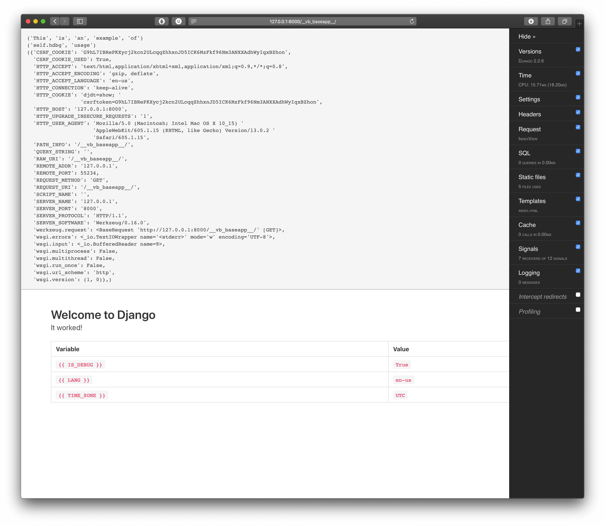

[](https://travis-ci.org/vbyazilim/django-vb-baseapp)


[](https://www.codacy.com/manual/vigo/django-vb-baseapp?utm_source=github.com&amp;utm_medium=referral&amp;utm_content=vbyazilim/django-vb-baseapp&amp;utm_campaign=Badge_Grade)
[](https://github.com/psf/black)

# django-vb-baseapp

This is a helper app for https://github.com/vbyazilim/django-vb-admin
and ships with while installation:

```bash
$ pip install django-vb-admin
$ django-vb-admin -h
```

It’s also available on PyPI and available via:

```bash
$ pip install django-vb-baseapp
```

## Features

- Two abstract custom base models: `CustomBaseModel` and `CustomBaseModelWithSoftDelete`
- Two custom base model admins: `CustomBaseModelAdmin` and `CustomBaseModelAdminWithSoftDelete`
- Soft deletion feature and admin actions for `CustomBaseModelAdminWithSoftDelete`
- `pre_undelete` and `post_undelete` signals for **soft delete** operation
- Pre enabled models admin site: `ContentTypeAdmin`, `LogEntryAdmin`, `PermissionAdmin`, `UserAdmin`
- Timezone and locale middlewares
- Onscreen debugging feature for views! (Template layer...)
- Handy utils: `numerify`, `save_file`, `SlackExceptionHandler`
- Fancy file widget: `AdminImageFileWidget` for `ImageField` on admin by default
- `OverwriteStorage` for overwriting file uploads
- Custom file storage for missing files for development environment: `FileNotFoundFileSystemStorage`
- Custom and configurable error page views for: `400`, `403`, `404`, `500`
- Custom management command with basic output feature `CustomBaseCommand`
- Builtin `console`, `console.dir()` via `vb-console` [package][vb-console]
- Simpler server logging for `runserver_plus`
- This project uses [bulma.io][bulma.io] as HTML/CSS framework, ships with **jQuery** and **Fontawesome**

---

## Screenshots

<table>
    <tr>
        <td></td>
        <td></td>
    </tr>
    <tr>
        <td></td>
        <td></td>
    </tr>
</table>

---

## Tutorial

Let’s build a basic blog with categories and tags! First, create a virtual
environment:

```bash
# via builtin
$ python -m venv my_env
$ source my_env/bin/activate

# or via virtualenvwrapper
$ mkvirtualenv my_env
```

Now, create a postgresql database;

```bash
$ createdb my_project_dev
```

Now set your environment variables:

```bash
$ export DJANGO_SECRET=$(head -c 75 /dev/random | base64 | tr -dc 'a-zA-Z0-9' | head -c 50)
$ export DATABASE_URL="postgres://localhost:5432/my_project_dev"
```

Edit `my_env/bin/activate` or `~/.virtualenvs/my_env/bin/postactivate`
(*according to your virtualenv creation procedure*) and put these export
variables in it. Will be handy next time you activate the environment. Now;

```bash
$ pip install django-vb-admin
$ cd /path/to/my-django-project
$ django-vb-admin startproject
# or
$ django-vb-admin startproject --target="/path/to/folder"
```

You’ll see:

```bash
Setup completed...
Now, create your virtual environment and run

	pip install -r requirements/development.pip

```

message. Now;

```bash
$ pip install -r requirements/development.pip
$ python manage.py migrate
Operations to perform:
  Apply all migrations: admin, auth, contenttypes, sessions
Running migrations:
  Applying contenttypes.0001_initial... OK
  Applying auth.0001_initial... OK
  Applying admin.0001_initial... OK
  Applying admin.0002_logentry_remove_auto_add... OK
  Applying admin.0003_logentry_add_action_flag_choices... OK
  Applying contenttypes.0002_remove_content_type_name... OK
  Applying auth.0002_alter_permission_name_max_length... OK
  Applying auth.0003_alter_user_email_max_length... OK
  Applying auth.0004_alter_user_username_opts... OK
  Applying auth.0005_alter_user_last_login_null... OK
  Applying auth.0006_require_contenttypes_0002... OK
  Applying auth.0007_alter_validators_add_error_messages... OK
  Applying auth.0008_alter_user_username_max_length... OK
  Applying auth.0009_alter_user_last_name_max_length... OK
  Applying auth.0010_alter_group_name_max_length... OK
  Applying auth.0011_update_proxy_permissions... OK
  Applying sessions.0001_initial... OK
```

Now, we have a ready Django project. Let’s check;

```bash
$ python manage.py runserver_plus

# or

$ rake

INFO |  * Running on http://127.0.0.1:8000/ (Press CTRL+C to quit)
INFO |  * Restarting with stat
Performing system checks...

System check identified no issues (0 silenced).

Django version X.X.X, using settings 'config.settings.development'
Development server is running at http://[127.0.0.1]:8000/
Using the Werkzeug debugger (http://werkzeug.pocoo.org/)
Quit the server with CONTROL-C.
WARNING |  * Debugger is active!
WARNING |  * Debugger PIN disabled. DEBUGGER UNSECURED!
```

Let’s create a **blog** app!

```bash
$ python manage.py create_app blog

# or

$ rake new:application[blog]

"blog" application created.


    - Do not forget to add your `blog` to `INSTALLED_APPS` under `config/settings/base.py`:

    INSTALLED_APPS += [
        'django_extensions',
        'blog.apps.BlogConfig', # <-- add this
    ]

    - Do not forget to fix your `config/urls.py`:

    # ...
    # add your newly created app's urls here!
    urlpatterns += [
        # ...
        # this is just an example!
        path('__blog__/', include('blog.urls', namespace='blog')),
        # ..
    ]
    # ...
```

You can follow the instructions, fix your `config/settings/base.py` and
`config/urls.py` as seen on the command output. Now run development server
and call the url:

```bash
$ python manage.py runserver_plus
```

Open `http://127.0.0.1:8000/__blog__/`. Also, another builtin app is running;
`http://127.0.0.1:8000/__vb_baseapp__/`. You can remove `__vb_baseapp__`
config from `config/urls.py`.

Now let’s add some models. We have 3 choices as parameters:

1. `django`: Uses Django’s `models.Model`
1. `basemodel`: Uses `CustomBaseModel` (which inherits from `models.Model`)
1. `softdelete`: Uses `CustomBaseModelWithSoftDelete`

We’ll use soft-deletable model to demonstrate soft-delete features. Let’s
create `Post`, `Category` and `Tag` models:

```bash
$ python manage.py create_model blog post softdelete

# or

$ rake new:model[blog,post,softdelete]

models/post.py created.
admin/post.py created.
post model added to models/__init__.py
post model added to admin/__init__.py


    `post` related files created successfully:

    - `blog/models/post.py`
    - `blog/admin/post.py`

    Please check your models before running `makemigrations` ok?

$ python manage.py create_model blog category softdelete

# or

$ rake new:model[blog,category,softdelete]

models/category.py created.
admin/category.py created.
category model added to models/__init__.py
category model added to admin/__init__.py


    `category` related files created successfully:

    - `blog/models/category.py`
    - `blog/admin/category.py`

    Please check your models before running `makemigrations` ok?

$ python manage.py create_model blog tag softdelete

# or

$ rake new:model[blog,tag,softdelete]

models/tag.py created.
admin/tag.py created.
tag model added to models/__init__.py
tag model added to admin/__init__.py


    `tag` related files created successfully:

    - `blog/models/tag.py`
    - `blog/admin/tag.py`

    Please check your models before running `makemigrations` ok?
```

Let’s fix models before creating and executing migrations:

```python
# blog/models/post.py

import logging

from django.conf import settings
from django.db import models
from django.utils.translation import ugettext_lazy as _

from console import console
from vb_baseapp.models import CustomBaseModelWithSoftDelete

__all__ = ['Post']

logger = logging.getLogger('app')
console = console(source=__name__)


class Post(CustomBaseModelWithSoftDelete):
    author = models.ForeignKey(
        to=settings.AUTH_USER_MODEL, on_delete=models.CASCADE, related_name='posts', verbose_name=_('author')
    )
    category = models.ForeignKey(
        to='Category', on_delete=models.CASCADE, related_name='posts', verbose_name=_('category')
    )
    title = models.CharField(max_length=255, verbose_name=_('title'))
    body = models.TextField(verbose_name=_('body'))
    tags = models.ManyToManyField(to='Tag', related_name='posts', blank=True)

    class Meta:
        app_label = 'blog'
        verbose_name = _('post')
        verbose_name_plural = _('posts')  # check pluralization

    def __str__(self):
        return self.title
```

and `Category` model:

```python
# blog/models/category.py

import logging

from django.db import models
from django.utils.translation import ugettext_lazy as _

from console import console
from vb_baseapp.models import CustomBaseModelWithSoftDelete

__all__ = ['Category']

logger = logging.getLogger('app')
console = console(source=__name__)


class Category(CustomBaseModelWithSoftDelete):
    title = models.CharField(max_length=255, verbose_name=_('title'))

    class Meta:
        app_label = 'blog'
        verbose_name = _('category')
        verbose_name_plural = _('categories')  # check pluralization

    def __str__(self):
        return self.title
```

and `Tag` model:

```python
# blog/models/tag.py

import logging

from django.db import models
from django.utils.translation import ugettext_lazy as _

from console import console
from vb_baseapp.models import CustomBaseModelWithSoftDelete

__all__ = ['Tag']

logger = logging.getLogger('app')
console = console(source=__name__)


class Tag(CustomBaseModelWithSoftDelete):
    name = models.CharField(max_length=255, verbose_name=_('name'))

    class Meta:
        app_label = 'blog'

    def __str__(self):
        return self.name
```

Let’s create and run migration file:

```bash
$ python manage.py makemigrations --name create_post_category_and_tag

# or

$ rake db:update[blog,create_post_category_and_tag]

Migrations for 'blog':
  applications/blog/migrations/0001_create_post_category_and_tag.py
    - Create model Category
    - Create model Tag
    - Create model Post

$ python manage.py migrate

# or

$ rake db:migrate

Operations to perform:
  Apply all migrations: admin, auth, blog, contenttypes, sessions
Running migrations:
  Applying blog.0001_create_post_category_and_tag... OK
```

Now we have a model which has relations to other models via `ForeignKey` and
`ManyToMany` level. Let’s tweak `blog/admin/post.py`:

```python
# blog/admin/post.py

import logging

from django.contrib import admin

from console import console
from vb_baseapp.admin import (
    CustomBaseModelAdminWithSoftDelete,
)

from ..models import Post

__all__ = ['PostAdmin']

logger = logging.getLogger('app')
console = console(source=__name__)


@admin.register(Post)
class PostAdmin(CustomBaseModelAdminWithSoftDelete):
    list_filter = ('category', 'tags', 'author')
    list_display = ('__str__', 'author')
    ordering = ('title',)
    # hide_deleted_at = False
```

Let’s create a super user and jump in to admin pages. `AUTH_PASSWORD_VALIDATORS`
is removed from **development** settings, you can type any password :)

```bash
$ python manage.py createsuperuser --username="${USER}" --email="your@email.com"
$ python manage.py runserver_plus

# or

$ rake

INFO |  * Running on http://127.0.0.1:8000/ (Press CTRL+C to quit)
INFO |  * Restarting with stat
Performing system checks...

System check identified no issues (0 silenced).

Django version X.X.X, using settings 'config.settings.development'
Development server is running at http://[127.0.0.1]:8000/
Using the Werkzeug debugger (http://werkzeug.pocoo.org/)
Quit the server with CONTROL-C.
WARNING |  * Debugger is active!
WARNING |  * Debugger PIN disabled. DEBUGGER UNSECURED!
INFO | GET | 302 | /admin/
INFO | GET | 200 | /admin/login/?next=/admin/
INFO | GET | 404 | /favicon.ico
:
:
```

Now open `http://127.0.0.1:8000/admin/` and add a new blog post! 
Create different categories and tags. Then open 
`http://127.0.0.1:8000/admin/blog/category/` page. 

In the Action menu, you’ll have couple extra options:

- Delete selected categories
- Recover selected categories (*Appears if you are filtering inactive records*)
- Hard delete selected categories

Now, delete one or more categories or tags. Check **activity state** filter
for post, category and tag models. You can recover deleted items from the
action menu too.

---

## Models

### `CustomBaseModel`

This is a common model. By default, `CustomBaseModel` contains these fields:

- `created_at`
- `updated_at`

Almost a default `models.Model` with two extra fields.

### `CustomBaseModelWithSoftDelete`

This model inherits from `CustomBaseModel` and provides fake deletion which is
probably called **SOFT DELETE**. This means, when you call model’s `delete()`
method or QuerySet’s `delete()` method, it acts like delete action but never
deletes the data.

Just sets the `deleted_at` field to **NOW**.

This works exactly like Django’s `delete()`. Broadcasts `pre_delete` and
`post_delete` signals and returns the number of objects marked as deleted and
a dictionary with the number of deletion-marks per object type.

You can call `hard_delete()` method to delete an instance or a queryset
actually.

This model uses `CustomBaseModelWithSoftDeleteManager` as default manager.

#### How soft-delete works?

When you call `.delete()` method of a model instance or queryset, model manager
sets `deleted_at` attribute to **NOW** all the way down through related
`ForeignKey` and `ManyToMany` fields. This means, you still keep everything.

Nothing is actually deleted, therefore your database constraints are still
work fine. When you access deleted (*inactive*) object from admin site, you’ll
see "deleted" text prefix in your related form fields if your related objects
are `CustomBaseModelWithSoftDelete` instances.

When you click **recover** button in the same page, all related and soft-deleted
objects’ `deleted_at` value will set to `NULL` and available again.

Please use `.actives()` queryset method instead of `.all()`. Why? `.all()`
method is untouched and works as default. When `all()` called, returning
queryset set contains everything event if the `deleted_at` is NULL or not...

#### Examples

```python
>>> Post.objects.all()

SELECT "blog_post"."id",
       "blog_post"."created_at",
       "blog_post"."updated_at",
       "blog_post"."deleted_at",
       "blog_post"."author_id",
       "blog_post"."category_id",
       "blog_post"."title",
       "blog_post"."body"
  FROM "blog_post"
 LIMIT 21


Execution time: 0.000950s [Database: default]

<CustomBaseModelWithSoftDeleteQuerySet [
    <Post: Python post 1>, 
    <Post: Python post 2>, 
    <Post: Python post 3>, 
    <Post: Python post 4>,
    :
    :
    :
    <Post: Golang post 4>
]>

>>> Category.objects.all()

SELECT "blog_category"."id",
       "blog_category"."created_at",
       "blog_category"."updated_at",
       "blog_category"."deleted_at",
       "blog_category"."title"
  FROM "blog_category"
 LIMIT 21


Execution time: 0.000643s [Database: default]

<CustomBaseModelWithSoftDeleteQuerySet [<Category: Python>, <Category: Ruby>, <Category: Bash>, <Category: Golang>]>

>>> Tag.objects.all()

SELECT "blog_tag"."id",
       "blog_tag"."created_at",
       "blog_tag"."updated_at",
       "blog_tag"."deleted_at",
       "blog_tag"."name"
  FROM "blog_tag"
 LIMIT 21


Execution time: 0.000519s [Database: default]

<CustomBaseModelWithSoftDeleteQuerySet [<Tag: textmate>, <Tag: pyc>, <Tag: irb>, <Tag: ipython>, <Tag: lock>, <Tag: environment>]>

>>> Category.objects.get(title='Bash').delete()
(9, {'blog.Post_tags': 4, 'blog.Category': 1, 'blog.Post': 4})

>>> Category.objects.delete()
(11, {'blog.Post_tags': 4, 'blog.Category': 3, 'blog.Post': 4})

>>> Category.objects.inactives()

SELECT "blog_category"."id",
       "blog_category"."created_at",
       "blog_category"."updated_at",
       "blog_category"."deleted_at",
       "blog_category"."title"
  FROM "blog_category"
 WHERE "blog_category"."deleted_at" IS NOT NULL
 LIMIT 21


Execution time: 0.000337s [Database: default]

<CustomBaseModelWithSoftDeleteQuerySet [<Category: Bash>]>

>>> Post.objects.inactives()

SELECT "blog_post"."id",
       "blog_post"."created_at",
       "blog_post"."updated_at",
       "blog_post"."deleted_at",
       "blog_post"."author_id",
       "blog_post"."category_id",
       "blog_post"."title",
       "blog_post"."body"
  FROM "blog_post"
 WHERE "blog_post"."deleted_at" IS NOT NULL
 LIMIT 21


Execution time: 0.000387s [Database: default]

<CustomBaseModelWithSoftDeleteQuerySet [<Post: Bash post 1>, <Post: Bash post 2>, <Post: Bash post 3>, <Post: Bash post 4>]>

>>> Category.objects.inactives().undelete()
(9, {'blog.Post_tags': 4, 'blog.Category': 1, 'blog.Post': 4})

>>> Category.objects.inactives()
<CustomBaseModelWithSoftDeleteQuerySet []>

>>> Post.objects.inactives()
<CustomBaseModelWithSoftDeleteQuerySet []>
```

`CustomBaseModelWithSoftDeleteQuerySet` has these query options:

- `.actives()` : filters if `CustomBaseModelWithSoftDelete.deleted_at` is set to `NULL`
- `.inactives()` : filters if `CustomBaseModelWithSoftDelete.deleted_at` is not set to `NULL`
- `.delete()` : soft delete on given object/queryset.
- `.undelete()` : recover soft deleted on given object/queryset.
- `.hard_delete()` : this is real delete. this method erases given object/queryset and there is no turning back!.

When soft-delete enabled (*during model creation*), Django admin will
automatically use `CustomBaseModelAdminWithSoftDelete` which is inherited from:
 `CustomBaseModelAdmin` <- `admin.ModelAdmin`.

---

## Model Admins

### `CustomBaseModelAdmin`, `CustomBaseModelAdminWithSoftDelete`

Inherits from `admin.ModelAdmin`. When model is created via `rake new:model...` 
or via management command, admin file is generated automatically.

This model admin overrides `models.ImageField` form field and displays fancy
thumbnail for images. By default, uses cached paginator and sets `show_full_result_count`
to `False` for performance improvements.

#### Model Admin Properties

`show_goback_button` is set to `True` by default. You can disable via;

```python
class ExampleAdmin(CustomBaseModelAdminWithSoftDelete):
    # ...
    show_goback_button = False
    # ...
```

- `show_full_result_count` is set to `False` by default.
- `hide_deleted_at` is set to `True` by default. This means, you will not see
that field while editing the instance.

Example for `Post` model admin (*auto generated*).

```python
import logging

from django.contrib import admin

from console import console
from vb_baseapp.admin import (
    CustomBaseModelAdminWithSoftDelete,
)

from ..models import Post

__all__ = ['PostAdmin']

logger = logging.getLogger('app')
console = console(source=__name__)


@admin.register(Post)
class PostAdmin(CustomBaseModelAdminWithSoftDelete):
    # hide_deleted_at = False
```

By default, `deleted_at` excluded from admin form like `created_at` and
`updated_at` fields. You can also override this via `hide_deleted_at`
attribute. Comment/Uncomment lines according to your needs! This works only in
`CustomBaseModelAdminWithSoftDelete`.

`CustomBaseModelAdminWithSoftDelete` also comes with special admin action. You can
recover/make active (*undelete*) multiple objects like deleting feature of
Django’s default.

### Extra Features

When you’re dealing with soft-deleted objects, you’ll see **HARD DELETE** and 
**RECOVER** buttons in the change form. Hard delete really wipes the items
from database. Recover, recovers/undeletes object and related elements.

You’ll also have **GO BACK** button too :)

---

## MiddleWare

### `CustomLocaleMiddleware`

This is mostly used for our custom projects. Injects `LANGUAGE_CODE` variable to
`request` object. `/en/path/to/page/` sets `request.LANGUAGE_CODE` to `en` otherwise `tr`.

```python
# add this to your settings/base.py
MIDDLEWARE += ['vb_baseapp.middlewares.CustomLocaleMiddleware']
```

### `TimezoneMiddleware`

If you have custom user model or you have `timezone` field in your `request.user`,
this middleware activates timezone for user.

---

## Custom Error Pages

You have a browsable (*only in development mode*) and customizable error handler
functions and html templates now!. Templates are under `templates/custom_errors/`
folder.

---

## Goodies

### `HtmlDebugMixin`



`self.hdbg(arg, arg, arg, ...)` method helps you to output/debug some data
in view layer.

```python
# example view: index.py

import logging

from django.views.generic.base import TemplateView

from console import console
from vb_baseapp.mixins import HtmlDebugMixin

__all__ = ['BlogView']

logger = logging.getLogger('app')
console = console(source=__name__)


class BlogView(HtmlDebugMixin, TemplateView):
    template_name = 'blog/index.html'

    def get_context_data(self, **kwargs):
        self.hdbg('Hello from hdbg')
        kwargs = super().get_context_data(**kwargs)
        console.dir(self.request.user)
        return kwargs
```

`` tag is added by default in to your `templates/base.html` and works
only if the settings `DEBUG` is set to `True`.

```django


<!DOCTYPE html>
<html>
<head>
    <meta charset="utf-8">
    <meta name="viewport" content="width=device-width, initial-scale=1">
    <title></title>
    
    <link rel="stylesheet" href="">
    <script defer src=""></script>
    
    <link rel="stylesheet" href="https://cdn.jsdelivr.net/npm/bulma@0.8.0/css/bulma.min.css">
    <script defer src="https://use.fontawesome.com/releases/v5.3.1/js/all.js"></script>
    
    <link rel="stylesheet" href="">
    <link rel="stylesheet" href="">
    
    <script defer src=""></script>
</head>
<body>
    
    
    
</body>
</html>
```

If you don’t want to extend from `templates/base.html` you can use your
own template. You just need to add `` tag in to your template if
you still want to enable this feature.

We have some mini helpers and tools shipped with `vb_baseapp`.

### `console`

This little tool helps you to output anything to console. This works only
in test and development mode. If you forget console declarations in your
code, do not worry... console checks `DJANGO_ENV` environment variable...

```python
from console import console

console = console(source=__name__)

console('hello', 'world')
```

You can inspect python object via `.dir()` method:

```python
console.dir([])

p = Post.objects.actives().first()
console.dir(p)
```

More information is available [here][vb-console]

### `vb_baseapp.utils.numerify`

Little helper for catching **QUERY_STRING** parameters for numerical values:

```python
from vb_baseapp.utils import numerify

>>> numerify("1")
1
>>> numerify("1a")
-1
>>> numerify("ab")
-1
>>> numerify("abc", default=44)
44
```

### `vb_baseapp.utils.save_file`

While using `FileField`, sometimes you need to handle uploaded files. In this
case, you need to use `upload_to` attribute. Take a look at the example:

```python
from vb_baseapp.utils import save_file as custom_save_file
:
:
:
class User(AbstractBaseUser, PermissionsMixin):
    :
    :
    avatar = models.FileField(
        upload_to=save_user_avatar,
        verbose_name=_('Profile Image'),
        null=True,
        blank=True,
    )
    :
    :
```

`save_user_avatar` returns `custom_save_file`’s return value. Default
configuration of for `custom_save_file` is 
`save_file(instance, filename, upload_to='upload/%Y/%m/%d/')`. Uploads are go to
such as `MEDIA_ROOT/upload/2017/09/21/`...

Make your custom uploads like:

```python
from vb_baseapp.utils import save_file as custom_save_file

def my_custom_uploader(instance, filename):
    # do your stuff
    # at the end, call:
    return custom_save_file(instance, filename, upload_to='images/%Y/')


class MyModel(models.Model):
    image = models.FileField(
        upload_to='my_custom_uploader',
        verbose_name=_('Profile Image'),
    )
```

### SlackExceptionHandler

`vb_baseapp.utils.log.SlackExceptionHandler`

You can send errors/exceptions to [slack](https://api.slack.com) channel.
Just create a slack app, get the webhook URL and set as `SLACK_HOOK`
environment variable. Due to slack message size limitation, `traceback`
is disabled.

Example message contains:

- http status
- error message
- exception message
- user.id or None
- full path

```bash
http status: 500
ERROR (internal IP): Internal Server Error: /__vb_baseapp__/
Exception: User matching query does not exist.
user_id: anonymous (None)
full path: /__vb_baseapp__/?foo=!
```

You can enable/disable in `config/settings/production.py` / `config/settings/heroku.py`:

```python
:
:
    'loggers': {
        'django.request': {'handlers': ['mail_admins', 'slack'], 'level': 'ERROR', 'propagate': False},  # remove 'slack'
    }
:
:
```

### `vb_baseapp.storage`

#### `FileNotFoundFileSystemStorage`

After shipping/deploying Django app, users start to upload files, right ?
Then you need to implement new features etc. You can get the dump of the
database but what about uploaded files ? Sometimes files are too much or
too big. If you call, let’s say, a model’s `ImageField`’s `url` property,
local dev server logs lot’s of **file not found** errors to console.

Also breaks the look of application via broken image signs in browser.

Now, you won’t see any errors... `FileNotFoundFileSystemStorage` is a
fake storage that handles non existing files. Returns `file-not-found.jpg`
from `static/images/` folder.

This is **development purposes** only! Do not use in the production!

You don’t need to change/add anything to your code... It’s embeded to
`config/settings/development.py`:

```python
:
:
DEFAULT_FILE_STORAGE = 'vb_baseapp.storage.FileNotFoundFileSystemStorage'
:
```

You can disable if you like to...

#### `OverwriteStorage`

`OverwriteStorage` helps you to overwrite file when uploading from django
admin. Example usage:

```python
# in a model
from vb_baseapp.storage import OverwriteStorage

class MyModel(models.Model):
    :
    :
    photo = models.ImageField(
        upload_to=save_media_photo,
        storage=OverwriteStorage(),
    )
    :
    :
```

Add `storage` option in your file related fields.

#### `AdminImageFileWidget`

Use this widget in your admin forms. By default, It’s already enabled in
`CustomBaseModelAdmin`. You can also inject this to Django’s default `ModelAdmin`
via example:

```python
from vb_baseapp.admin.widgets import AdminImageFileWidget

class MyAdmin(admin.ModelAdmin):
    formfield_overrides = {
        models.FileField: {'widget': AdminImageFileWidget},
    }
```

This widget uses `Pillow` (*Python Image Library*) which ships with your `base.pip`
requirements file. Show image preview, width x height if the file is image.

#### `context_processors.py`

By default, `vb_baseapp` injects few variables to you context:

- `DJANGO_ENV`
- `IS_DEBUG`
- `LANGUAGE_CODE`
- `CURRENT_GIT_TAG`
- `CURRENT_PYTHON_VERSION`
- `CURRENT_DJANGO_VERSION`

---

## Reminders

Default timezone is set to `UTC`, please change this or use according to your
needs.

```python
# config/settings/base.py
# ...
TIME_ZONE = 'UTC'
# ...
```

---

## Management Commands

`vb_baseapp` ships with three managements commands;

### `create_app`

```bash
$ python manage.py create_app NAME_OF_APP
```

Creates new Django application under `applications/` and provides application
folder structure:

    applications/NAME_OF_APP/
    ├── admin
    ├── management
    ├── migrations
    ├── models
    ├── tests
    ├── views
    ├── __init__.py
    ├── apps.py
    └── urls.py

### `create_model`

```bash
$ python manage.py create_model NAME_OF_APP NAME_OF_MODEL STYLE_OF_MODEL
```

Creates Django model. You have three different model style;

1. `django`: Uses Django’s `models.Model`
1. `basemodel`: Uses `CustomBaseModel` (which inherits from `models.Model`)
1. `softdelete`: Uses `CustomBaseModelWithSoftDelete`

According to your model choice, related files will be generated.

### `create_custom_user_model`

```bash
$ python manage.py create_custom_user_model NAME_OF_APP NAME_OF_MODEL STYLE_OF_MODEL 
```

This command will work only in the beginning state of development. Creating
a custom user model is prohibited in the middle of the development. You
must decide before you create other models or run initial migrations for
Django’s default.

This command creates;

- Admin files
- Model manager files
- Model admin form files
- Model files

for given argumens. Let’s say you’ll start a fresh project and want to use
custom user model. First, you need to create an app:

```bash
$ python manage.py create_app blog
# follow the instructions
$ python manage.py create_custom_user_model blog CustomUser softdelete

Set AUTH_USER_MODEL in config file
models/custom_user.py created.
admin/custom_user.py created.
CustomUser model added to models/__init__.py
CustomUser model added to admin/__init__.py
CustomUser forms added to admin/forms/__init__.py
admin/forms/custom_user.py created.

Custom user installation completed. Now please check your;

    - blog/models/custom_user.py
    - blog/admin/custom_user.py
    - blog/admin/forms/custom_user.py

Also;

    - `email` field is set to `USERNAME_FIELD`
    - `first_name` and `last_name` are set as `REQUIRED_FIELDS`
    - `middle_name`, `profile_image` are optionals

Make sure if all ok? Make your changes before running migrations:

    $ python manage.py makemigrations --name create_custom_users
```

We’ve created `CustomUser` model from softdeletable object. Default fields
are:

- `email`: `EmailField`
- `first_name`: `CharField`
- `middle_name`: (optional) `CharField`
- `last_name`: `CharField`
- `profile_image`: (optional) `FileField`
- `is_active`: (optional) `BooleanField`
- `is_staff`: (optional) `BooleanField`

and other fields inherited from `AbstractBaseUser`:

- `password`
- `last_login`

and other properties from `PermissionsMixin`. You can add/change or remove
fields before creating migrations. Do not forget to check these files for
`CustomUser` for the sake of this example:

- `admin/custom_user.py`
- `admin/forms/custom_user.py`
- `models/custom_user.py`

Also, this management commands sets `AUTH_USER_MODEL` value in `config/base.py`.
You’ll see;

```python
AUTH_USER_MODEL = 'blog.CustomUser'
```

since you’ve named the custom model as `CustomUser`.

---

## Rake Tasks

You have some handy rake tasks if you like to use `ruby` :)

```bash
$ rake -T

rake db:migrate[database]                                        # Run migration for given database (default: 'default')
rake db:roll_back[name_of_application,name_of_migration]         # Roll-back (name of application, name of migration)
rake db:shell                                                    # run database shell ..
rake db:show[name_of_application]                                # Show migrations for an application (default: 'all')
rake db:update[name_of_application,name_of_migration,is_empty]   # Update migration (name of application, name of migration?, is empty?)
rake default                                                     # Default task: runserver_plus (Werkzeug)
rake locale:compile                                              # Compile locale dictionary
rake locale:update                                               # Update locale dictionary
rake new:application[name_of_application]                        # Create new Django application
rake new:model[name_of_application,name_of_model,type_of_model]  # Create new Model for given application: django,basemodel,softdelete
rake runserver:default                                           # Run: runserver (Django's default server)
rake runserver:default_ipdb                                      # Run: runserver (Django's default server) + ipdb debug support
rake runserver:plus                                              # Run: runserver_plus (Werkzeug)
rake runserver:plus_ipdb                                         # Run: runserver_plus (Werkzeug) + ipdb debug support
rake shell[repl]                                                 # Run shell+ avail: ptpython,ipython,bpython default: ptpython
rake test:browse_coverage[port]                                  # Browse test coverage
rake test:coverage[cli_args]                                     # Show test coverage (default: '--show-missing --ignore-errors --skip-covered')
rake test:run[name_of_application,verbose]                       # Run tests for given application
```

Default task is `runserver:plus`. Just type `rake` that’s it! `runserver:plus` uses
`runserver_plus`. This means you have lots of debugging options!

### `runserver` based tasks

- `rake runserver:default`: runs `python manage.py runserver`
- `rake runserver:default_ipdb`: runs Django’s default server with debugging
  feature. You can inject `breakpoint()` in your code! Debugger kicks in!
- `rake runserver:plus`: runs `python manage.py runserver_plus --nothreading`
- `rake runserver:plus_ipdb`: runs `runserver:plus` with debugging!

### `rake db:migrate[database]`

Migrates database with given database name. Default is `default`. If you like
to work multiple databases:

```python
# example configuration

DATABASES = {
    'default': {
        'ENGINE': 'django.db.backends.sqlite3',
        'NAME': os.path.join(BASE_DIR, 'db', 'development.sqlite3'),
    },
    'my_database': {
        'ENGINE': 'django.db.backends.sqlite3',
        'NAME': os.path.join(BASE_DIR, 'db', 'my_database.sqlite3'),
    }
}
```

You can just call `rake db:migrate` or specify different database like: 
`rake db:migrate[my_database]` :)

### `rake db:show[name_of_application]`

Show migration information:

```bash
$ rake db:show[blog]
blog
 [X] 0001_create_post_category_and_tag
 [ ] 0002_add_spot_field_to_post

$ rake db:migrate
Running migration for: default database...
Operations to perform:
  Apply all migrations: admin, auth, blog, contenttypes, sessions
Running migrations:
  Applying blog.0002_add_spot_field_to_post... OK
```

### `rake db:roll_back[name_of_application,name_of_migration]`

Your database must be rollable :) To see available migrations: 
`rake db:roll_back[NAME_OF_YOUR_APPLICATION]`. Look at the list and choose your
target migration. You can use just the number as shortcut. In this example,
we’ll roll back to migration number 1, which has a name: `0001_create_post_category_and_tag`

```bash
$ rake db:roll_back[blog]
Please select your migration:
blog
 [X] 0001_create_post_category_and_tag
 [X] 0002_add_spot_field_to_post

$ rake db:roll_back[blog,1]
Operations to perform:
  Target specific migration: 0001_create_post_category_and_tag, from blog
Running migrations:
  Rendering model states... DONE
  Unapplying blog.0002_add_spot_field_to_post... OK

$ rake db:show[blog]
blog
 [X] 0001_create_post_category_and_tag
 [ ] 0002_add_spot_field_to_post
```

### `rake db:update[name_of_application,name_of_migration,is_empty]`

When you add/change something in your model, you need to create migrations.
Let’s say you have added new field to `Post` model in your `blog` app:

If you don’t provide `name_of_migration` param, you’ll endup with auto
generated name such as `000X_auto_YYYMMDD_HHMM`. You can also create
empty migration via 3^rd parameter: `yes`

```bash
$ rake db:update[blog,add_spot_field_to_post]
Migrations for 'blog':
  applications/blog/migrations/0002_add_spot_field_to_post.py
    - Add field spot to post

$ rake db:update[blog,add_new_field_to_post,yes]  # empty migration example
Migrations for 'blog':
  applications/blog/migrations/0003_add_new_field_to_post.py

$ cat applications/blog/migrations/0003_add_new_field_to_post.py
```

empty migration output:

```python
from django.db import migrations


class Migration(migrations.Migration):

    dependencies = [
        ('blog', '0002_add_spot_field_to_post'),
    ]

    operations = [
    ]
```

### `rake db:shell`

Runs default database client.

### `rake new:application[name_of_application]`

Creates new application with given application name!

```bash
$ rake new:application[blog]
```

### `rake new:model[name_of_application,name_of_model,type_of_model]`

Creates new model! Available model types are:

- `django` (default),
- `basemodel`
- `softdelete`

```bash
$ rake new:model[blog,Post]                # will create model using Django’s `models.Model`
$ rake new:model[blog,Post,basemodel]      # will create model using our `CustomBaseModel`
$ rake new:model[blog,Post,softdelete]     # will create model using our `CustomBaseModelWithSoftDelete`
```

### `rake locale:compile` and `rake locale:update`

When you make changes in your application related to locales, run: `rake locale:update`.
When you finish editing your `django.po` file, run `rake locale:compile`.

### `rake shell[repl]`

Runs Django repl/shell with use `shell_plus` of [django-extensions][01].
 `rake shell`. This loads everything to your shell! Also you can see the
SQL statements while playing in shell. We have couple different repls:

1. `ptpython`
1. `bpython`
1. `ipython`

Default repl is: `ptpython`

```bash
$ rake shell
$ rake shell[bpython]
$ rake shell[ipython]
```

### `rake test:run[name_of_application,verbose]`

If you don’t provide `name_of_application` default value will be `applications`. 
`verbose` is `1` by default.

Examples:

```bash
$ rake test:run
$ rake test:run[vb_baseapp,2]
```

### `rake test:coverage[cli_args]`

Get the test report. Default is `--show-missing --ignore-errors --skip-covered` for
`cli_args` parameter.

```bash
$ rake test:coverage
```

### `rake test:browse_coverage[port]`

Serves generated html coverages under `htmlcov` folder via `python`. Default port
is `9001`

---

## Run Tests Manually

```bash
$ DJANGO_ENV=test python manage.py test vb_baseapp -v 2                                 # or
$ DJANGO_ENV=test python manage.py test vb_baseapp.tests.test_user.CustomUserTestCase   # run single unit
$ rake test:run[vb_baseapp]
```

---

## Manual Usage

Let’s assume you need a model called: `Page`. Create a file under `YOUR_APP/models/page.py`:

```python
# example for Django’s default model
# YOUR_APP/models/page.py

from django.db import models

__all__ = ['Page',]

class Page(models.Model):
    # define your fields here...
    pass

# YOUR_APP/models/__init__.py
# append:
from .page import *
```

or, you can use `CustomBaseModel` or `CustomBaseModelWithSoftDelete`:

```bash
from django.db import models

from vb_baseapp.models import CustomBaseModelWithSoftDelete

__all__ = ['Page']

class Page(CustomBaseModelWithSoftDelete):
    # define your fields here...
    pass
```

Now make migrations etc... Use it as `from YOUR_APP.models import Page` :)

---

## License

This project is licensed under MIT

---

## Contributer(s)

* [Uğur "vigo" Özyılmazel](https://github.com/vigo) - Creator, maintainer

---

## Contribute

All PR’s are welcome!

1. `fork` (https://github.com/vbyazilim/django-vb-baseapp/fork)
1. Create your `branch` (`git checkout -b my-features`)
1. `commit` yours (`git commit -am 'Add awesome features'`)
1. `push` your `branch` (`git push origin my-features`)
1. Than create a new **Pull Request**!

---

## Change Log

**2019-12-05**

- Django 2.2.8

**2019-12-04**

- Add custom user model generator
- Version bump

**2019-11-30**

- Update and fix typos in README file

**2019-11-28**

- Add tests and travis integration
- Version bump

**2019-11-27**

- Version bump
- Ready to use...

**2019-08-07**

- Initial Beta relase: 1.0.0

---

[vb-console]: https://github.com/vbyazilim/vb-console
[bulma.io]: https://bulma.io